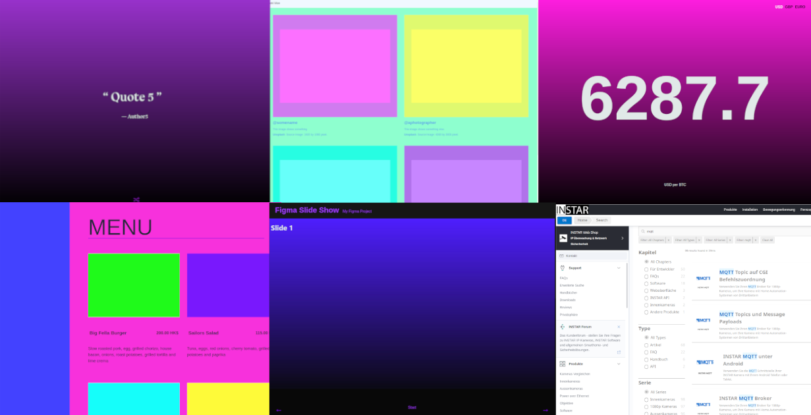

# Working with JSON Web APIs

I found these tutorial/lecture notes describing how to use vanilla Javascript to pull web content from public web APIs. Be offline at the time I tried to recreate them using a local webserver:

* Figma
* Unsplash
* Contentful
* Coindesk
* Elasticsearch (WIP)

## How to Use

Just copy the content of a folder of your choice from this repository to the public web root of your web server. Find and edit the `fetch(url)` to point to the JSON file that holds the page data.